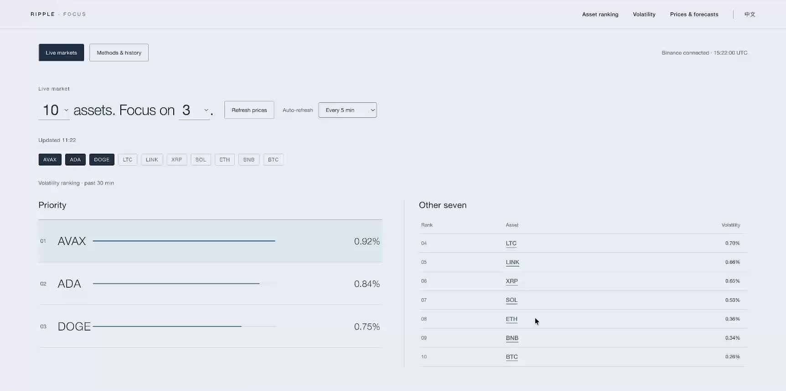

# Ripple

**An attention assistant for fast-moving markets: decide which assets to check first.**

Ripple monitors ten assets, prioritizes three using observed volatility, and provides a separate model-based drawdown estimate. Cryptocurrency prices are the live test data, supplied by Binance's public API; the product's focus is managing attention.



[Demo video](docs/Ripple-demo.mp4)

## What you can do

- See all ten assets and the three highest in past-30-minute volatility.
- Inspect price charts with a cached, 30-minute Kronos forecast.
- Compare each asset's recent 10-minute volatility with its 120-minute baseline. A ratio of at least 1.2 is highlighted.
- Replay three historical shocks and explore a graph of subsequent asset triggers. The graph shows timing associations, not causation.
- Read method comparisons and failed experiments in the same interface, in English or Chinese.

Live data refreshes every five minutes by default; the interval is adjustable. The separate historical recovery reference remains fixed at 25 minutes for the smaller-asset group and 46 for the larger-asset group. These are historical statistics, not predictions or countdowns.

## Run locally

Python 3.12 was used for development. Node.js is only needed for frontend tests; the website has no build step. Live forecasting also requires the model dependencies and approximately 425 MB of downloaded weights. The public market feed requires no API key.

From the repository root:

```bash
python3 -m venv .venv
.venv/bin/pip install -r requirements.txt
.venv/bin/python scripts/download_models.py
.venv/bin/python -m ripple_live.server --port 5176
```

Open [Ripple in English](http://127.0.0.1:5176/index.html?lang=en) or [中文](http://127.0.0.1:5176/). The server listens on the local computer only. CPU, Apple MPS, or CUDA is selected according to availability; inference speed depends on the machine. An unavailable feed or model is reported rather than replaced with fabricated live values.

For the frozen historical demonstration **without model downloads or ML dependencies**:

```bash
python3 -m http.server 5177 --bind 127.0.0.1 --directory ripple_web
```

Open [Methods & history](http://127.0.0.1:5177/index.html?lang=en&mode=history). Live APIs are not available in this static mode.

## How it works

```text
Binance closed 1-minute bars → validated shared market window
                               ├─ observed volatility → priority ranking
                               ├─ 10 / 120 minute volatility → current state
                               └─ 256-minute input → Kronos-base → 30-minute path
                                                        ↓
                                              deterministic drawdown

Frozen historical results → replay, timing graph, evaluation tables
```

Forecasts are sampled once per market window, identified, validated, and cached. Selecting another asset does not rerun the model. Predictions from an older window are not silently overlaid on newer input data. The live view uses one generated path per asset; the selected historical replays include ten-path summaries labeled uncalibrated.

## Results that shaped the product

The January comparison covers 84 frozen shocks; February contains 56 observational follow-up events.

| Measurement | Past-30-minute baseline | Original Kronos |
| --- | ---: | ---: |
| January volatility Top3 recall ↑ | **73.41%** | 61.51% |
| January drawdown MAE ↓ | 46.12 bps | **37.64 bps** |
| February volatility Top3 recall ↑ | **64.29%** | 53.57% |
| February drawdown MAE ↓ | 59.33 bps | **49.49 bps** |

The baseline therefore determines priority; the original model supplies a separate drawdown estimate. These are results on the stated samples, not a guarantee of future performance. Top3 recall uses tie-aware scoring and is not an exact-set hit rate. One basis point is 0.01 percentage points.

LoRA experiments are included as research, not production models. The ranking experiment improved the smaller-asset group's exact Top2 match score by 4.67 percentage points over the original model but remained below simple baselines; the larger-asset group fell by 7 points. The drawdown experiment did not establish a reliable improvement. Neither fine-tuned model shipped.

Direction prediction did not establish a useful advantage. Only 10 of 30 asset-event outcomes in three selected replay events fell inside the sampled drawdown interval; these are not 30 independent events. Intervals are uncalibrated. An asset outside the priority three can still move sharply: priority means where to start inspecting, not which assets are safe to ignore.

## Code and verification

| Directory | Responsibility |
| --- | --- |
| `ripple_web/` | Bilingual interface and frozen display data |
| `ripple_live/` | Validated live market snapshots and forecast API |
| `model_adapter/` | Local sktime/Kronos inference and output validation |
| `forecast_metrics/` | Deterministic arithmetic on frozen forecasts |
| `demo_app/` | Isolated model worker and earlier application components |
| `data_pipeline/`, `evaluation/` | Historical inputs, rolling comparisons, and scoring |
| `research/` | Shock analysis source and selected frozen results |
| `lora_a/`, `lora_c/` | Fine-tuning experiment source and selected results |

Run the interface and live-service checks without training or downloading historical data:

```bash
node --test ripple_web/*.test.mjs
.venv/bin/python -m unittest ripple_live.test_market ripple_live.test_service -v
```

Research source is provided for inspection and reproducibility, but full training and historical evaluation require separately obtained input data and additional experiment dependencies. Raw market archives, model weights, runtime logs, credentials, and local development history are deliberately excluded from this public snapshot.

## Credits

Built with Python, native JavaScript, PyTorch, sktime, and [Kronos](https://github.com/shiyu-coder/Kronos). Market data comes from Binance. See [third-party notices](THIRD_PARTY_NOTICES.md) for pinned model sources and licensing boundaries.
