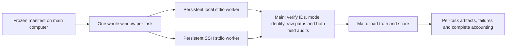

# Tonight's two-computer batch helper

This is a bounded command-line backtest helper. Tomorrow's browser demo still
uses one computer. There is no HTTP worker service, automatic deployment,
scheduler, cloud resource, training, or automatic whole-month run.

The coordinator owns the frozen task manifest and all future truth/scoring.
Each computer has one persistent model process and receives a complete past-only
window containing BTC/ETH/SOL and the requested path count. Devices process
different windows; a window's paths are never split across devices.



## Current verification boundary

Latest integration evidence supersedes the earlier local-pilot boundary below:
the current v3 dual-audit policy completed a fixed 96-window local batch with
96/96 scored, no failures/retries/unrun tasks, in 163.429 seconds. This is a
one-worker result, not a speedup measurement. The project's 154-test regression
suite includes this helper's local protocol/failure checks. See
`evaluation/HARNESS_ACCEPTANCE.md` and
`research/2026-09-26-expanded-evaluation.md`. The latest remote probe failed DNS
resolution before authentication; remote execution and cancellation remain
unverified. The following paragraph records the earlier pilot stage.

Fourteen local unit/integration checks pass using explicitly marked fake model adapters,
fake transports and actual local fake-worker subprocesses. They verify protocol
framing, model-object reuse, whole-task assignment, timeouts, request/result
identity checks, both audit gates and retained failures. The root integrator
completed a real two-window local pilot under the earlier containment-only
policy. The current volume-audit amendment has separate fixture checks and does
not retroactively change that pilot's artifacts. **Actual remote deployment,
two-device execution and speedup remain unverified.** Authenticated remote
access and a small real batch must be verified before claiming two-device execution.
Task fields and nested candle/provenance fields are allowlisted, every historical
timestamp is checked against the origin, and duplicate task IDs are rejected
even if submitted under new request IDs. The local `ssh -G` configuration check
previously verified known-host/control paths containing spaces without connecting;
it was not rerun for the volume-audit amendment.

## Prepare once, manually

The other computer needs the same project modules and compatible Python
dependencies, plus local model/tokenizer weights. It does not need the Binance
archive: every task carries its own past input, and the main computer retains
future truth. Do not transfer `.env`, credentials, unrelated files or a Mac's
virtual environment as part of preparing the worker.

The SSH host must already be authenticated and its key present in the explicit
`known_hosts` file. This helper always uses `BatchMode=yes` and
`StrictHostKeyChecking=yes`; it does not accept a new host key or prompt for a
password. `--control-path` can reuse the user-established authenticated SSH
connection. Credentials and host trust remain outside this helper.

## Freeze a small common workload

Run from the project root with the existing virtual environment:

```sh
scenario-lab/.venv/bin/python -m evaluation.runner \
  --limit 4 --stride 30 --paths 1 \
  --out evaluation/runs/tonight-four --plan-only
```

The manifest is immutable by content identity. Start with this small common
workload before choosing a larger explicit limit. Reuse the exact same manifest
for local, remote and combined measurements; do not compare different workloads.

## Local-only baseline

```sh
scenario-lab/.venv/bin/python -m demo_app.distributed \
  --mode local \
  --manifest evaluation/runs/tonight-four/manifest.json \
  --out evaluation/runs/tonight-local
```

## Remote-only or both computers

Replace the example host and remote paths with the verified values. The remote
working directory must be absolute. Paths containing spaces are shell-quoted
by the program rather than interpolated as commands.

```sh
scenario-lab/.venv/bin/python -m demo_app.distributed \
  --mode both \
  --manifest evaluation/runs/tonight-four/manifest.json \
  --out evaluation/runs/tonight-both \
  --ssh-host USER@HOST \
  --remote-cwd '/absolute/path/to/HackUMBC' \
  --remote-python 'scenario-lab/.venv/bin/python' \
  --known-hosts demo_app/runtime/ssh_known_hosts \
  --control-path '/absolute/path/to/existing-control-socket'
```

Use `--mode remote` for the remote-only baseline. `--ssh-port` defaults to 22.
`--device` and `--remote-device` default to `auto`. Different checkpoint locations
can be supplied through `--remote-model-path` / `--remote-tokenizer-path`; their
content identities still have to match the coordinator's expected weights.

The coordinator obtains expected identity by hashing the local checkpoints
without running a forecast. Alternatively, `--expected-identity path.json`
accepts an explicitly pinned identity. Workers must match model/tokenizer hashes,
adapter revision, sampling settings, output correction policy, volume policy and
sktime version. The current adapter revision is `sktime-kronos-field-quality-v3`,
with `containment-expand-v1` and `unused-volume-audit-v1`; a worker using the old
policy cannot join a new-policy batch.
Backend and Torch version are recorded; different backends are not asserted to
be numerically identical merely because their model identity matches.

## Results and failure behavior

Each invocation writes a new `batch_<id>/` beneath `--out`:

- `tasks/<task_id>.json`: original response/raw paths, immutable forecast ID,
  main-computer validation/scoring, separate OHLC correction and volume quality,
  source/profile/quote identity and timings, or the exact failure. Nonfinite
  rejected values remain explicitly encoded strings.
- `logs/local.stderr.log` / `logs/remote.stderr.log`: model and SSH diagnostics.
  Worker stdout contains only bounded JSON protocol frames.
- `summary.json`: worker identities, all denominators, model-specific weighted
  correction rates, exploratory volume-quality observations and total wall
  time. Unrun tasks have explicit artifacts.

Both the worker and coordinator call the model-owned
`validate_forecast_output(forecast, raw_paths)` before publishing a result.
This requires complete OHLC correction records and a volume audit bound to every
untouched raw candle. Finite negative predicted volume/amount are retained and
marked `volume_forecast_unavailable`; they are unused by the price metrics and
do not alone fail a price forecast. Missing fields/bars, nonfinite values,
nonpositive prices and missing or inconsistent audit records still fail.
No clipping, resampling or silent audit reconstruction occurs at either boundary.
Volume quality is machine-readable evaluation evidence, not a UI signal or a
financial alarm. Failed or unvalidated audits remain visible in artifacts but
cannot contribute validated quality statistics. Earlier batches remain unchanged.

The task deadline defaults to 300 seconds and initialization to 90 seconds;
change them explicitly with `--task-timeout` and `--init-timeout` if the pilot
shows they are too short. Timeout closes/terminates the coordinator-side process
or SSH channel and marks the task failed. Immediate cancellation of an already
running remote native inference after channel loss has not been remotely
verified; check the remote process if a timeout occurs. Ctrl-C stops dispatching
new tasks, closes active channels, and retains completed/failed/unrun accounting.

A model-reported invalid output remains a failed sample while other tasks can
continue. Protocol, identity or publication-validation violations quarantine that
worker. No failed task is retried, silently moved to another device, filtered
from the denominator, or sampled again until it passes. Re-running is a new
recorded batch, not hidden recovery.

In both mode the first task is reserved for each worker; later tasks come from a
shared queue. This ensures a small pilot actually assigns both workers some work.
Initialization failure is visible; a healthy worker may finish other unassigned
tasks, but it does not retry the failed worker's assigned task.

Compare `batch_wall_ms` only between complete runs of the identical manifest.
It includes process startup, model startup, transport, inference, validation,
scoring and artifact writes. `runtime.inference_ms` is a different, narrower
measurement. A speedup requires measured single/both results; two connected
workers alone do not prove acceleration.

## Checks without model inference

```sh
scenario-lab/.venv/bin/python -m unittest demo_app.test_distributed -v
```

Python entry point: `execute_manifest(manifest, transports={name: factory},
expected_identity=identity, out_dir=...)`. Factories create one persistent
transport with `call(request, timeout)` and `close()`. Unit tests inject marked
fixtures through this boundary; the command-line path always uses the actual
model worker.
